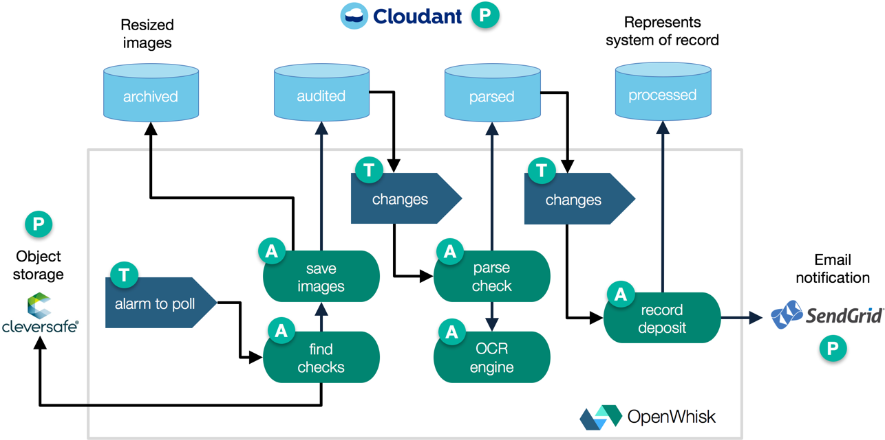
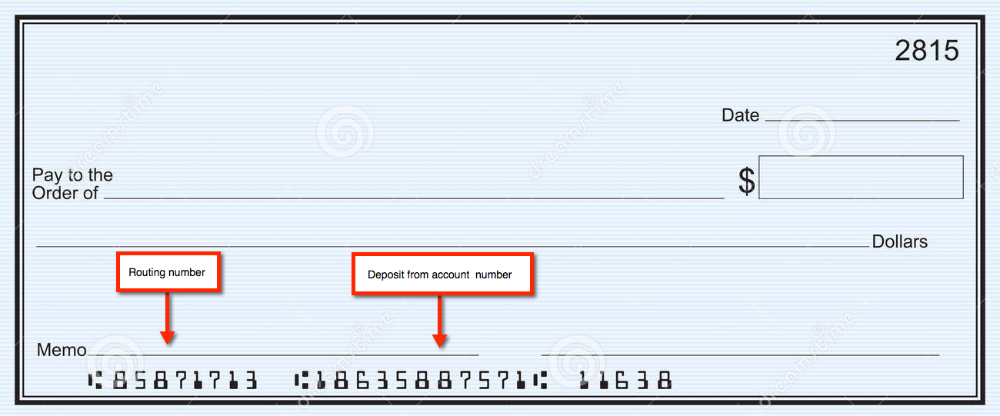

# Project OpenChecks
This proof of concept shows how OpenWhisk can be used for an event-driven architecture that processes the deposit of checks to a bank account using optical character recognition.

It is currently built on the public Bluemix OpenWhisk service and relies on Cloudant and SoftLayer Object Storage. On premises, it could use CouchDB and OpenStack Swift. Other storage services could include FileNet or Cleversafe. Tesseract provides the OCR library.

## Basic flow
This PoC uses a set of actions, triggers, and rules to process images that are added to an object storage service. When new checks are detected a workflow downloads, resizes, archives, and reads the checks then it invokes an external system to handle the transaction.

* A mobile app user or teller at a bank branch scans and places an image into an object storage service (the `incoming` container) named with the customer email, deposit to account, amount of the check, and timestamp encoded in the file name, for example, `krook@example.com^12345679^19.99^1475597757.jpg`
* A `poll-for-incoming-checks` trigger invokes the `find-new-checks` action every 20 seconds to poll the object storage service for new check images. (An alternative implementation can use an OpenStack Swift webhook to push this event instead of polling).
* This `find-new-checks` action queries the object storage service. For each file found, it invokes the `save-check-images` action asynchronously.
* The `save-check-images` action downloads the image and puts two resized copies (50% and 25% scaled) into an `archive` CouchDB database and the original in an `audit` database. When all inserts have completed successfully, the files are deleted from the object storage service.
* A `check-ready-to-scan` change trigger on the `audit` CouchDB database invokes a `parse-check-data` action to process the full size image.
* This `parse-check-data` action retrieves the image, then calls the `parse-check-with-ocr` Docker action to read the from account information and routing number. If it can't read this information, the check is flagged as needing additional human review. It stores the results into a `parsed` CouchDB database.
* A `check-ready-for-deposit` trigger is then fired by that change to the `parsed` database and invokes another action, `record-check-deposit`.
* This `record-check-deposit` action retrieves the account details from the `parsed` record, logs the transaction in the `processed` database and sends an email with SendGrid (simulating connectivity to external system).

## Sample check images
There are two checks in the `images` directory that the OCR action can read reliably right now.

Notice the MICR data at the bottom of the check representing the routing number and deposit from account.

The amount data is not currently parsable, nor is the deposit to account information. This will need to be passed as metadata.

## Technical details
Most of the actions are written in JavaScript using the default Node.js version 6 environment on Bluemix. One of the actions is written as a shell script and packaged in a Docker container. This shows both the polyglot nature of OpenWhisk, as well as the ability to package any arbitrary program, as is needed in this case to leverage an OCR library.

## Provision services and set environment variables
Start by copying `template.local.env` to a new `local.env` file. You can fill in additional details as you go through the steps below. The `.gitignore` file will prevent that private file from being pushed to source control if you push modifications to your own fork.

### Set up Cloudant
Log into the Bluemix console and create a Cloudant instance and name it `checks-db`. You can reuse an existing instance if you already have one. Update `CLOUDANT_INSTANCE` in `local.env` to reflect the name of the Cloudant service instance.

Then set the `CLOUDANT_USERNAME` and `CLOUDANT_PASSWORD` values in `local.env` based on the service credentials for the service.

Log into the Cloudant console and create four databases. Set their names in the `CLOUDANT_ARCHIVED_DATABASE`, `CLOUDANT_AUDITED_DATABASE`, `CLOUDANT_PARSED_DATABASE`, and `CLOUDANT_PROCESSED_DATABASE` variables.

### Set up Object Storage
Log into the Bluemix console and create an Object Storage instance and name it `checks-os`. Create a container within named `checks`. Update the `local.env` variables for `SWIFT_USER_ID`, `SWIFT_PASSWORD`, `SWIFT_PROJECT_ID`, and `SWIFT_REGION_NAME` accordingly.

### Set up SendGrid
Log into the Bluemix console and create a SendGrid instance. If you don't want to pay for the minimum plan, you can go to SendGrid.com directly to request a free trial. Follow the developer documentation to configure an API key. Update `local.env` accordingly.

## Set up OpenWhisk actions, triggers, and rules
If you haven't already, download, install, and test the [`wsk` CLI tool](https://new-console.ng.bluemix.net/openwhisk/cli) with your Bluemix account.

Run the following commands to set up the OpenWhisk resources with a deployment script:
* Make sure `local.env` is complete. Run `source local.env`.
* Run the `deploy.sh` script. For example, `./deploy.sh --install`

## Running the sample
At this point the triggers, rules, and actions are in place. The Object Storage polling trigger will run every 20 seconds for half an hour by default (90 invocations). You can change this in the `deploy.sh` script by modifying the `maxTriggers` value.

Open another terminal to start tailing the OpenWhisk logs with `wsk activation poll` so you can see the progress when you start running the sample and are able to debug any issues.

To start the sample, rename the two check images to contain a valid email address that you have access to. That is where the SendGrid notifications will be sent. Then use the Bluemix UI to add those images to your `checks` container.

The `find-new-checks` action will download the images on its next poll (within 20 seconds as set by the alarm trigger) and this will start the sequence of actions.

If all has been successful, you will have 25% and 50% resized copies of the check images as attachments in your `CLOUDANT_ARCHIVED_DATABASE`. You will have the original image as an attachment in your `CLOUDANT_AUDITED_DATABASE`. You will have the OCR parsed from the check and its filename in the `CLOUDANT_PARSED_DATABASE` and you will have the final transaction info (simulating an external system of record) in the `CLOUDANT_PROCESSED_DATABASE`.

## Known issues
* With the default free Cloudant account, this demo may hit the request per second rate. There may also be conflicts shown in the logs due to retries on image insertions. Confirm that the data in Cloudant is as you expect.
* Rather than polling Object Storage, the save image action should be driven by a webhook from OpenStack Swift. As this is not something that you can configure in Bluemix today, the polling option is used.
