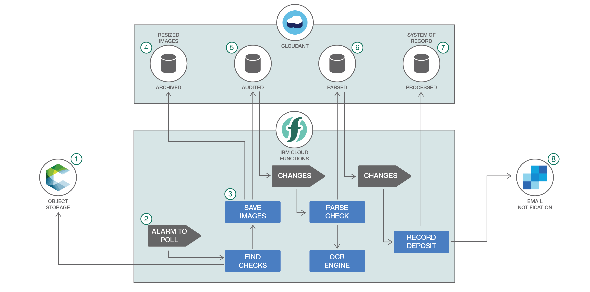

# Retail banking check deposit processing with OpenWhisk

This project demonstrates [serverless technology - powered by Apache OpenWhisk on IBM Bluemix -](https://developer.ibm.com/opentech/2016/09/06/what-makes-serverless-attractive/) in the context of a retail banking scenario where deposited checks are processed digitally (such as through a mobile banking app) using optical character recognition (OCR).

This sort of use case is ideal for a serverless architecture because it addresses compute-intensive and highly elastic payday deposit processing where the workload spikes for one particular timeframe every two weeks.

It also highlights a few OpenWhisk programming model concepts, which include rules, triggers, sequences, and invoking actions from other actions directly. Furthermore, it demonstrates a use case where polyglot development is applied in order to package an third-party C library for OCR as an action.

You should have a basic understanding of the OpenWhisk programming model. If not, [try the action, trigger, and rule demo first](https://github.com/IBM/openwhisk-action-trigger-rule). You'll also need a Bluemix account and the latest [OpenWhisk command line tool (`wsk`) installed and on your PATH](https://github.com/IBM/openwhisk-action-trigger-rule/blob/master/docs/OPENWHISK.md).

It is currently built on the public Bluemix OpenWhisk service and relies on Cloudant and SoftLayer Object Storage. On premises, it could use CouchDB and OpenStack Swift. Other storage services could include FileNet or Cleversafe. [Tesseract](https://github.com/tesseract-ocr/tesseract) provides the OCR library.

## Components

- Apache OpenWhisk on Bluemix
- Object Storage on Bluemix
- Apache CouchDB (IBM Cloudant on Bluemix)
- SendGrid on Bluemix
- Docker Hub

## Bank deposit processing with OpenWhisk

This project uses a set of actions and triggers linked by rules to process images that are added to an object storage service. When new checks are detected a workflow downloads, resizes, archives, and reads the checks then it invokes an external system to handle the transaction.

Most of the actions are written in JavaScript using the default Node.js version 6 environment on Bluemix. One of the actions is written as a shell script and packaged in a Docker container. This shows both the polyglot nature of OpenWhisk, as well as the ability to package any arbitrary program, as is needed in this case to leverage an OCR library.

## Primary workflow

- A mobile app user or teller at a bank branch scans a check and puts the image into an object storage service (the `incoming` container) named with the customer email, deposit to account, amount of the check, and timestamp encoded in the file name, for example, `krook@example.com^12345679^19.99^1475597757.jpg`

- A `poll-for-incoming-checks` trigger invokes the [`find-new-checks`](actions/find-new-checks.js) action every 20 seconds to poll the object storage service for new check images. (An alternative implementation should use an [OpenStack Swift webhook](https://github.com/stmuraka/OpenStackSwift-OpenWhisk) to push this event instead of polling).

- This [`find-new-checks`](actions/find-new-checks.js) action queries the object storage service. For each file found, it invokes the [`save-check-images`](actions/save-check-images.js) action asynchronously, which processes them in parallel.

- The [`save-check-images`](actions/save-check-images.js) action downloads the check image and puts two resized copies (50% and 25% scaled) into an `archive` CouchDB database and the original in an `audit` database. When all inserts have completed successfully, the files are deleted from the object storage service.

- A `check-ready-to-scan` change trigger on the `audit` CouchDB database invokes a [`parse-check-data`](actions/parse-check-data.js) action to process the full-size image.

- This [`parse-check-data`](actions/parse-check-data.js) action retrieves the image, then calls the [`parse-check-with-ocr`](dockerSkeleton/parse-check-with-ocr.sh) Docker action to read the payer account information and routing number. It stores the results into a `parsed` CouchDB database. If it can't read this information, the check is flagged as needing additional human review and stored in a `rejected` database.

- A `check-ready-for-deposit` trigger is then fired by that change to the `parsed` database and invokes another action, [`record-check-deposit`](actions/record-check-deposit.js).

- This [`record-check-deposit`](actions/record-check-deposit.js) action retrieves the account details from the `parsed` record, logs the transaction in the `processed` database and sends an email with SendGrid (simulating connectivity to external system).

## Sample check images

There are three checks in the `images` directory that the OCR action can read reliably and two that will fail in order to show the alternate workflows (and to provide an exercise for improving the image recognition capabilities).

Notice the [MICR](https://en.wikipedia.org/wiki/Magnetic_ink_character_recognition) data at the bottom of the check representing the routing number and payer (deposit from) account number.

The amount data is not currently parsable, nor is the deposit to account information, as these are handwritten on most checks. This will need to be passed as metadata (and later the algorithm may be improved to handle this case with a more powerful service).

## Running the sample application

1. [Set up the Bluemix services (Cloudant, Object Storage, Docker Hub)](docs/BLUEMIX.md).
2. [Set up the OpenWhisk actions, triggers, and rules](docs/OPENWHISK.md).

# License

[Apache 2.0](LICENSE.txt)
